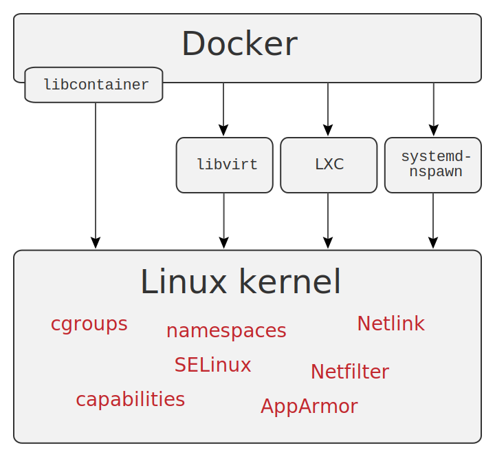

========
 Docker
========

.. rst-class:: docker

   .. image:: _static/docker.png

.. rst-class:: movile

   .. image:: _static/movile.png

.. rst-class:: date

17 de Abril de 2015

.. rst-class:: me

   Ariel Gerardo Ríos

.. rst-class:: personal-data

   |email|

.. rst-class:: personal-data

   |twitter|_

.. _twitter: https://twitter.com/ariel_17_
.. |twitter| replace:: @ariel_17_
.. |email| replace:: ariel.rios@movile.com

Qué es Docker
=============

* Es una plataforma para desarrollar, desplegar y ejecutar aplicaciones
  distribuidas.

* Según `451 Research`_: *"Es una herramienta que puede empaquetar una
  aplicación y sus depedencias en un contenedor virtual que puede ejecutarse en
  cualquier servidor Linux."*

.. rst-class:: centered

   .. image:: _static/whatisdocker.jpg

.. _`451 Research`: https://451research.com/

Qué es Docker
=============

* Es un proyecto open source :)

.. image:: _static/github.png

Por qué Docker
==============

* Todos hablamos el mismo idioma.
* Disminuye la fricción de llevar aplicaciones a producción.
* Permite estandarizar diferentes ambientes (desarrollo, QA, producción) y
  clonarlos a demanda.

Por qué Docker
==============

* Menos recursos que una máquina virtual (mucho menos).

.. rst-class:: inline

   .. image:: _static/vm-stack.png

.. rst-class:: inline

   VS

.. rst-class:: inline

   .. image:: _static/docker-stack.png

Por qué Docker
==============

* Hay una comunidad que comparte sus artefactos.

.. image:: _static/community.png

Cómo está compuesto: Arquitectura
=================================

.. rst-class:: architecture

   .. image:: _static/architecture.svg

Cómo está compuesto: Arquitectura
=================================

* **Cliente:** es la interfaz de usuario para la administración de las imágenes
  y los contenedores.
* **Demonio:** es gestor de la plataforma de virtualización. Construye las
  imágenes, crea/destruye los contenedores, comunicación con el índice de
  imágenes, etc.
* **Imagen:** Es un template de sólo lectura
* **Contenedor:** es una instancia de una imágen (análogo a POO) ejecutándose.
* **Registros:** un servicio en línea para almacenar y compartir las
  imágenes; pueden ser públicos o privados.

Cómo está compuesto: Tecnología
===============================

Cómo está compuesto: Tecnología
===============================

* **Espacio de nombres:** *Namespaces*. Crea espacios de trabajo aislado entre
  contenedores.
* **Grupos de control:** *cgroups*. Herramienta del kernel de Linux para
  limitar, contabilizar y aislar el uso de recursos.
* **Formato del contenedor:** Formato de implementación del contenedor.

.. note:: 

   * Namespaces: cada aspecto del contenedor se ejecuta bajo su propio espacio
     de nombre y no tiene acceso a recursos por fuera de éste.
   
   * Cgroups: Por ejemplo, limitar la cantidad de memoria disponible para un
     contenedor.

Cómo está compuesto: Imágenes
=============================

Ejemplo de Dockerfile:

.. include:: examples/Dockerfile
   :literal:
